# Academic Services and Student Records Chatbot

A production-ready, scalable chatbot application built with **LangGraph** for answering student questions about **academic services** and **their student records**. Features document OCR via **GLM-4 Vision**, knowledge-base retrieval with **Qdrant**, and deployment-ready architecture for **LangSmith/LangGraph Platform**.

---

## Architecture Overview

```
student-records-chatbot/
├── src/
│   ├── agent.py              # Main entry point & high-level API
│   ├── api/                  # FastAPI application package
│   │   ├── __init__.py       # FastAPI REST & WebSocket server entry point
│   │   ├── helpers.py        # API helper utilities
│   │   ├── models.py         # Request/response models
│   │   ├── services.py       # API orchestration services
│   │   ├── sessions.py       # Session registry access
│   │   └── routes/           # Route handlers
│   ├── config/
│   │   ├── __init__.py
│   │   ├── logging.py        # RFC 5424 logging configuration
│   │   └── settings.py       # Pydantic settings + env management
│   ├── graphs/
│   │   ├── __init__.py
│   │   └── workflow.py       # LangGraph definition & compilation
│   ├── services/
│   │   ├── __init__.py
│   │   ├── contracts.py      # Service protocols / dependency contracts
│   │   ├── document_processing.py
│   │   ├── intent.py
│   │   ├── response_generation.py
│   │   ├── session_registry.py
│   │   └── student_records.py
│   ├── utils/
│   │   ├── __init__.py
│   │   ├── cache.py          # Redis-backed cache helpers
│   │   ├── state.py          # State schema (AgentState, models)
│   │   ├── nodes/            # LangGraph node adapters + prompts
│   │   └── tools/            # OCR, Qdrant, storage, student tools
├── tests/                    # Pytest test suite
├── data/
│   ├── raw/                  # Uploaded documents
│   └── processed/            # Processing outputs
├── scripts/                  # Utility scripts
├── .env                      # Environment variables (not committed)
├── .env.example              # Environment template
├── langgraph.json            # LangGraph deployment config
├── pyproject.toml            # UV/Pip project config
├── uv.lock                   # Locked dependency set
└── README.md                 # This file
```

### Graph Structure

```
                         ┌─────────────────┐
                         │   router_node   │  ← Classifies intent
                         └────────┬────────┘
                                  │
              ┌─────────────┼─────────────┐
              │             │             │
        [upload]    [student record]  [service/general]
              │             │             │
    ┌─────────▼────────┐   │    ┌────────▼────────┐
    │ process_document │   │    │    retrieve     │  ← Qdrant search for service docs
    │  (GLM-4 OCR)     │   │    │                 │
    └────────┬────────┘   │    └────────┬────────┘
             │             │             │
             │    ┌────────▼────────┐   │
             │    │ handle_student  │  ← Record lookup / CRUD
             │    │  (Student Data) │
             │    └────────┬────────┘
             │             │
             └──────┐      └─────┐      │
                    │            │      │
        ┌───────────▼────────────▼──────▼──────┐
        │          generate_response          │  ← LLM with context
        └────────────────┬────────────────────┘
                         │
                ┌────────▼────────┐
                │  check_errors   │  ← Error handling & retry
                └────────┬────────┘
                         │
                    [END]
```

### Ingestion Process

```mermaid
flowchart LR
    A[User uploads file<br/>API or CLI] --> B[DocumentTools.save_upload<br/>Persist to data/raw]
    B --> C[Detect document type<br/>transcript, id_card, application, recommendation,<br/>curriculum, syllabus, certificate, invoice, policy, other]
    C --> D[DocumentProcessingNode.run<br/>Mark status processing]
    D --> E[GLMOCRTool.extract_text<br/>Read file and call GLM-4 Vision OCR]
    E --> F[Store extracted text<br/>and OCR confidence on DocumentUpload]
    F --> G[HierarchicalChunker.chunk_document<br/>parent and child chunks]
    G --> H[ParentChunkStore.put_many<br/>persist parent sections]
    H --> I[OpenAIEmbeddings.aembed_documents<br/>embed child chunks]
    I --> J[Qdrant upsert<br/>child text + metadata + vector]
    J --> K[Document marked completed<br/>chunk IDs saved in state]
```



The ingestion path in code is:

1. `DocumentProcessingNode.prepare_upload()` calls `DocumentTools.save_upload()` to assign a UUID, persist the raw file, and infer `document_type`.
2. `DocumentProcessingNode._process_document()` marks the document as `processing` and sends the stored file to `GLMOCRTool.extract_text()`.
3. `GLMOCRTool` base64-encodes the document, builds a type-aware OCR prompt, and returns extracted text plus a confidence estimate.
4. `VectorStoreTools.store_document_chunks()` parses the extracted text into hierarchical parent/child chunks, persists the parent records, generates embeddings for child chunks with the configured `EMBEDDING_MODEL`, upserts those child chunks into Qdrant with document metadata, and invalidates Redis-backed retrieval cache entries.
5. The document is marked `completed`, and its `chunk_ids` plus `parent_chunk_ids` are retained for later retrieval and response generation.

---

## Quick Start

### Prerequisites

- **Python 3.11+**
- **UV** (fast Python package manager) - [Install Guide](https://docs.astral.sh/uv/getting-started/installation/)
- **Qdrant** running locally or cloud instance
- **Redis** for retrieval caching (recommended)
- API keys for OpenAI and Zhipu AI (GLM-4)
- Optional: FastEmbed reranker model download if you set `RETRIEVAL_STRATEGY=reranker`
- If you switch an existing Qdrant collection to `RETRIEVAL_STRATEGY=rrf`, recreate or reindex it so sparse lexical vectors are available for fusion

### 1. Install UV

```bash
# macOS/Linux
curl -LsSf https://astral.sh/uv/install.sh | sh

# Windows PowerShell
powershell -c "irm https://astral.sh/uv/install.ps1 | more"
```

### 2. Setup Project

```bash
# Clone the repository
git clone <your-repo-url>
cd student-records-chatbot

# Create virtual environment with uv
uv venv .venv --python 3.11

# Activate environment
source .venv/bin/activate  # macOS/Linux
# .venv\Scripts\activate    # Windows

# Install dependencies
uv sync --dev
# Or:
# uv pip install -e ".[dev]"
```

### 3. Configure Environment

```bash
cp .env.example .env
# Edit .env with your API keys:
# - OPENAI_API_KEY
# - ZHIPU_API_KEY (for GLM-4 OCR)
# - QDRANT_URL
# - REDIS_URL
# - LANGSMITH_API_KEY
```

### 4. Start Qdrant (Local)

```bash
docker run -p 6333:6333 -p 6334:6334 \
  -v $(pwd)/qdrant_storage:/qdrant/storage \
  qdrant/qdrant
```

### 5. Start Redis (Local)

```bash
docker run -p 6379:6379 redis:7-alpine
```

### 6. Run the Application

**Interactive CLI:**
```bash
python -m src.agent
```

**REST API Server:**
```bash
uvicorn src.api:app --reload --port 8000
```

**LangGraph Development:**
```bash
langgraph dev
```

---

## API Endpoints

| Method | Endpoint | Description |
|--------|----------|-------------|
| `GET` | `/health` | Health check |
| `POST` | `/chat` | Send chat message |
| `POST` | `/chat/upload` | Chat with file upload |
| `POST` | `/upload` | Upload documents only |
| `WS` | `/ws/{session_id}` | WebSocket streaming |

### Example API Usage

```bash
# Health check
curl http://localhost:8000/health

# Chat for a student record question
curl -X POST http://localhost:8000/chat \
  -H "Content-Type: application/json" \
  -d '{"message": "What is my GPA?"}'

# Chat for an academic service question
curl -X POST http://localhost:8000/chat \
  -H "Content-Type: application/json" \
  -d '{"message": "How do I request an enrollment verification letter?"}'

# Upload and chat
curl -X POST http://localhost:8000/chat/upload \
  -F "message=Process this transcript" \
  -F "files=@transcript.pdf"
```

---

## Deployment

### LangGraph Platform (LangSmith)

1. **Configure `langgraph.json`:**
   ```json
   {
     "graphs": {
       "student_records_agent": "./src/agent.py:compiled_app"
     },
     "env": ".env"
   }
   ```

2. **Deploy via CLI:**
   ```bash
   # Install LangGraph CLI
   pip install langgraph-cli

   # Authenticate
   langgraph login

   # Deploy
   langgraph deploy
   ```

3. **Configure LangSmith tracing in `.env`:**
   ```env
   LANGSMITH_TRACING=true
   LANGSMITH_API_KEY=your_key
   LANGSMITH_PROJECT=student-records-chatbot
   ```

### Docker Deployment

```dockerfile
FROM python:3.11-slim

WORKDIR /app

# Install UV
COPY --from=ghcr.io/astral-sh/uv:latest /uv /uvx /bin/

# Copy project files
COPY pyproject.toml uv.lock ./
COPY src/ ./src/

# Install dependencies
RUN uv sync --frozen --no-dev

# Run
CMD ["uvicorn", "src.api:app", "--host", "0.0.0.0", "--port", "8000"]
```

---

## Migration Guide: From Spaghetti Code to LangGraph

### Problem: Spaghetti Code Pattern

```python
# BEFORE: Typical unstructured chatbot code
import openai

def handle_user_input(user_input, files=None):
    # Everything in one function
    if files:
        text = extract_text(files[0])  # Where is this defined?
        chunks = split_text(text)      # Magic numbers everywhere
        store_in_db(chunks)            # No error handling
    
    # Scattered state management
    global conversation_history
    conversation_history.append(user_input)
    
    # Intent detection mixed with response
    if "upload" in user_input:
        response = process_upload(user_input)
    elif "query" in user_input:
        results = search_db(user_input)
        response = format_results(results)
    else:
        response = openai.ChatCompletion.create(...)
    
    return response
```

**Problems with this approach:**
- No clear state management
- Mixed concerns (routing, processing, response)
- No observability or tracing
- Hard to test or extend
- No error recovery

### Solution: LangGraph Architecture

#### Step 1: Define Clear State Schema

```python
# Define your complete state upfront
class AgentState(BaseModel):
    messages: Sequence[BaseMessage]
    current_intent: Optional[str]
    pending_documents: List[DocumentUpload]
    retrieved_chunks: List[Dict]
    # ... all state fields explicit
```

#### Step 2: Separate into Pure Functions (Nodes)

```python
# Each node is a pure function: State -> State Updates
def router_node(state: AgentState) -> Dict:
    """Classify intent, return ONLY state changes."""
    intent = classify_intent(state.messages[-1])
    return {"current_intent": intent}  # Clear output

def process_document_node(state: AgentState) -> Dict:
    """Process documents independently."""
    for doc in state.pending_documents:
        text = ocr.extract(doc.file_path)
        chunks = vector_store.store(text)
    return {"processed_documents": [...]}

def response_node(state: AgentState) -> Dict:
    """Generate response with full context."""
    context = build_context(state.retrieved_chunks)
    response = llm.generate(state.messages, context)
    return {"messages": [response]}
```

#### Step 3: Connect with Explicit Edges

```python
# Define routing logic separately
def route_by_intent(state: AgentState) -> str:
    if state.current_intent == "upload":
        return "process_document"
    elif state.current_intent == "query":
        return "retrieve"
    return "response"

# Build the graph
workflow = StateGraph(AgentState)
workflow.add_node("router", router_node)
workflow.add_node("process_document", process_document_node)
workflow.add_node("response", response_node)

workflow.add_conditional_edges("router", route_by_intent)
workflow.add_edge("process_document", "response")
app = workflow.compile()
```

#### Step 4: Add Observability

```python
# LangSmith automatically traces each node execution
# View the full execution graph in the LangSmith UI

# Each node execution is logged with:
# - Input state
# - Output state
# - Execution time
# - Token usage
```

### Migration Checklist

| Task | Description |
|------|-------------|
| **Identify State** | List all variables that change during conversation |
| **Define Schema** | Create `AgentState` with all fields typed |
| **Extract Nodes** | Convert each operation to a pure function |
| **Define Routing** | Make intent logic explicit and testable |
| **Add Error Handling** | Use error handler nodes, not try/except spaghetti |
| **Configure Persistence** | Add checkpointer for conversation memory |
| **Add Tests** | Test each node independently |
| **Deploy** | Use `langgraph.json` for platform deployment |

---

## Configuration Reference

### Environment Variables

| Variable | Description | Default |
|----------|-------------|---------|
| `OPENAI_API_KEY` | OpenAI API key | Required |
| `OPENAI_BASE_URL` | OpenAI-compatible base URL | `https://openrouter.ai/api/v1` |
| `LLM_MODEL` | Primary LLM model | `deepseek/deepseek-v4-flash:exacto` |
| `LLM_REASONING_ENABLED` | Send provider reasoning controls with LLM requests when supported | `true` |
| `LLM_REASONING_EFFORT` | Reasoning effort (`xhigh`, `high`, `medium`, `low`, `minimal`, or `none`) | `medium` |
| `LLM_REASONING_MAX_TOKENS` | Maximum reasoning tokens; when set, this is used instead of effort | None |
| `LLM_REASONING_EXCLUDE` | Use reasoning internally without returning reasoning text when supported | `true` |
| `EMBEDDING_MODEL` | Embedding model for vector search | `qwen/qwen3-embedding-8b:nitro` |
| `ZHIPU_API_KEY` | Zhipu AI API key (GLM-4) | Required |
| `ZHIPU_BASE_URL` | Zhipu AI base URL | `https://open.bigmodel.cn/api/paas/v4` |
| `GLM_OCR_MODEL` | OCR vision model | `glm-4v-flash` |
| `QDRANT_URL` | Qdrant instance URL | `http://localhost:6333` |
| `QDRANT_API_KEY` | Qdrant API key | None |
| `QDRANT_COLLECTION_NAME` | Vector collection name | `student_documents` |
| `VECTOR_SIZE` | Embedding vector dimension | `4096` |
| `RETRIEVAL_STRATEGY` | Retrieval ranking strategy (`similarity`, `rrf`, or `reranker`) | `similarity` |
| `RERANKER_MODEL` | Reranker model used when reranking is enabled | None |
| `RERANKER_BASE_URL` | Remote reranker base URL. If unset, local FastEmbed reranking is used | None |
| `RERANKER_API_KEY` | API key for the remote reranker endpoint | None |
| `RERANKER_CANDIDATE_MULTIPLIER` | First-stage overfetch multiplier before reranking | `6` |
| `REDIS_URL` | Redis URL for retrieval caching | None |
| `REDIS_KEY_PREFIX` | Redis key namespace | `student-records-chatbot` |
| `REDIS_CACHE_TTL_SECONDS` | Retrieval result cache TTL | `300` |
| `LANGSMITH_TRACING` | Enable LangSmith tracing | `true` |
| `LANGSMITH_ENDPOINT` | LangSmith API endpoint | `https://api.smith.langchain.com` |
| `LANGSMITH_API_KEY` | LangSmith API key | Required |
| `LANGSMITH_PROJECT` | LangSmith project name | `student-records-chatbot` |
| `APP_ENV` | Application environment | `development` |
| `DEBUG` | Enable debug mode | `false` |
| `LOG_LEVEL` | Application log level | `INFO` |
| `DATA_DIR` | Base data directory | `data` |

---

## Development

### Running Tests

```bash
# Run all tests
pytest

# Run with coverage
pytest --cov=src --cov-report=html

# Run specific test file
pytest tests/test_workflow.py
```

### Code Quality

```bash
# Format with Ruff
ruff format .

# Lint
ruff check .

# Type check
mypy src/
```

---

## Tech Stack

| Component | Technology |
|-----------|------------|
| **Agent Framework** | LangGraph |
| **LLM** | OpenAI-compatible provider via configured `LLM_MODEL` |
| **OCR** | GLM-4 Vision (Zhipu AI) |
| **Vector DB** | Qdrant |
| **Embeddings** | Configurable via `EMBEDDING_MODEL` |
| **API** | FastAPI + Uvicorn |
| **Config** | Pydantic Settings |
| **Package Manager** | UV |
| **Observability** | LangSmith |

---

## License

MIT License - see LICENSE file for details.
