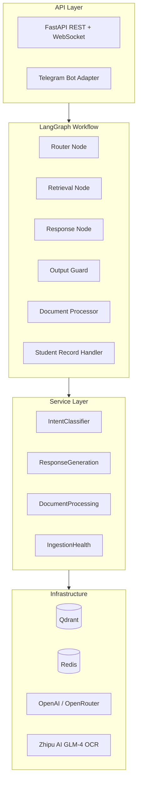
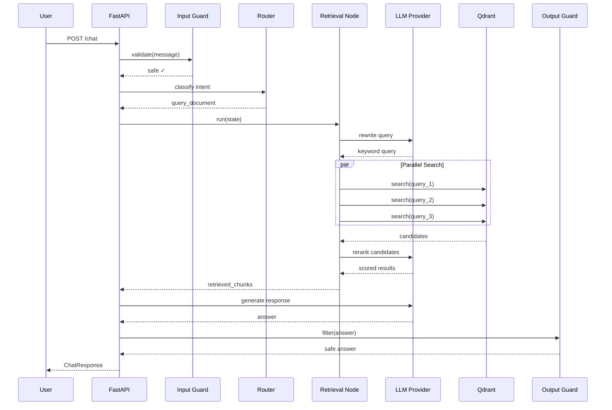

# Architecture

## System Overview

PASsistant is a Retrieval-Augmented Generation (RAG) chatbot built on LangGraph. It processes academic documents (PDF) through OCR, indexes them into a vector database, and answers student questions by retrieving relevant context and generating grounded responses.

## Component Diagram



## Request Lifecycle



## Key Design Decisions

### Hierarchical Parent-Child Chunking

Documents are parsed into a tree structure mirroring their logical hierarchy (chapters → sections → subsections). Child chunks (small, indexed in vector DB) point to parent chunks (larger, stored on disk). At retrieval time, child hits are hydrated with parent context for richer LLM input.

### Contextual Embedding

Child chunk text is prepended with its breadcrumb path before embedding. This ensures that a table chunk under "III.4. Program Studi Teknik Informatika > Semester V" encodes the prodi and semester context in its vector, even if the raw table only contains course codes.

### Hybrid Retrieval with Reranking

Three retrieval strategies are supported:
- **similarity** — Dense cosine similarity only
- **rrf** — Reciprocal Rank Fusion of dense + BM25 sparse vectors
- **reranker** — First-stage RRF/similarity candidates re-scored by a cross-encoder

### Parallel Multi-Query

Up to 3 query variants (original, LLM-rewritten, expanded) are searched in parallel via `asyncio.gather`, reducing retrieval latency from 3x to 1x the single-query time.

## Directory Structure

```
src/
├── agent.py                 # LangGraph app entry point
├── api/                     # FastAPI REST + WebSocket layer
│   ├── routes/              # Endpoint handlers
│   ├── models.py            # Pydantic request/response schemas
│   └── services.py          # API orchestration
├── config/                  # Settings and logging
├── eval/                    # RAGAS evaluation framework
│   └── ragas/               # Evaluator, CLI, reporting
├── graphs/                  # LangGraph workflow definition
├── guardrails/              # Input/output safety filters
├── services/                # Business logic (intent, response, ingestion)
├── telegram_bot/            # Telegram integration
└── utils/
    ├── nodes/               # LangGraph node implementations
    ├── tools/               # OCR, chunking, student tools
    └── vector_store/        # Qdrant operations (indexing, search, BM25)
```
