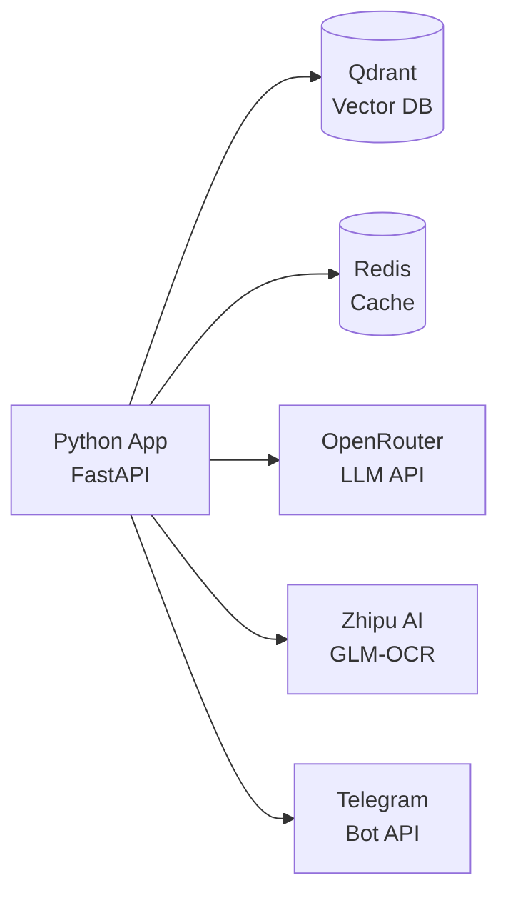

# Deployment Guide

## Infrastructure Requirements



| Service | Purpose | Minimum Spec |
|---------|---------|--------------|
| Qdrant | Vector database | 1GB RAM, persistent storage |
| Redis | Search cache + parent chunk cache | 512MB RAM |
| Python app | FastAPI server | 1 vCPU, 1GB RAM |
| LLM API | Response generation, query rewrite | OpenRouter / OpenAI account |
| Zhipu AI | GLM-4 OCR for PDF ingestion | API key |

## Docker Compose (Development)

```yaml
version: "3.8"
services:
  qdrant:
    image: qdrant/qdrant:latest
    ports:
      - "6333:6333"
      - "6334:6334"
    volumes:
      - qdrant_storage:/qdrant/storage

  redis:
    image: redis:7-alpine
    ports:
      - "6379:6379"

  app:
    build: .
    ports:
      - "8000:8000"
    env_file: .env
    depends_on:
      - qdrant
      - redis

volumes:
  qdrant_storage:
```

## Dockerfile

```dockerfile
FROM python:3.11-slim
WORKDIR /app

COPY --from=ghcr.io/astral-sh/uv:latest /uv /uvx /bin/

COPY pyproject.toml uv.lock ./
RUN uv sync --frozen --no-dev

COPY src/ ./src/
COPY data/ ./data/

EXPOSE 8000
CMD ["uv", "run", "uvicorn", "src.api:app", "--host", "0.0.0.0", "--port", "8000"]
```

## Environment Configuration

### Required Variables

```bash
# LLM Provider
OPENAI_API_KEY=your_key
OPENAI_BASE_URL=https://openrouter.ai/api/v1
LLM_MODEL=deepseek/deepseek-v4-flash:exacto
EMBEDDING_MODEL=qwen/qwen3-embedding-8b:nitro

# OCR
ZHIPU_API_KEY=your_zhipu_key

# Infrastructure
QDRANT_URL=http://qdrant:6333
REDIS_URL=redis://redis:6379/0

# Retrieval
RETRIEVAL_STRATEGY=reranker
RETRIEVAL_TOP_K=10
RERANKER_MODEL=jinaai/jina-reranker-v2-base-multilingual
RERANKER_BASE_URL=https://api.jina.ai/v1
RERANKER_API_KEY=your_jina_key
```

### Production Recommendations

```bash
APP_ENV=production
DEBUG=false
LOG_LEVEL=INFO
REDIS_CACHE_TTL_SECONDS=600
```

## Telegram Bot Deployment

### Webhook Mode (Production)

```bash
# Set environment variables
TELEGRAM_ENABLED=true
TELEGRAM_BOT_TOKEN=your_bot_token
TELEGRAM_WEBHOOK_URL=https://your-domain.com/telegram/webhook
TELEGRAM_WEBHOOK_SECRET_TOKEN=random_secret_string

# Register webhook
curl -X POST "https://api.telegram.org/bot${TELEGRAM_BOT_TOKEN}/setWebhook" \
  -H "Content-Type: application/json" \
  -d "{
    \"url\": \"${TELEGRAM_WEBHOOK_URL}\",
    \"secret_token\": \"${TELEGRAM_WEBHOOK_SECRET_TOKEN}\",
    \"allowed_updates\": [\"message\"]
  }"
```

### Polling Mode (Development)

```bash
uv run python -m src.telegram_bot.polling
```

## LangGraph Platform

```bash
langgraph login
langgraph deploy
```

Config in `langgraph.json` points to `src/agent.py:compiled_app`.

## Post-Deployment Checklist

1. **Verify health endpoint**: `GET /health` should return healthy status for Qdrant and Redis
2. **Ingest documents**: Upload academic PDFs via `POST /upload`
3. **Verify ingestion**: `GET /documents` should list uploaded files with chunk counts
4. **Test queries**: Send test questions via `POST /chat`
5. **Monitor**: Check LangSmith traces for latency and errors

## Monitoring

- **LangSmith** — Full trace visibility for every LLM call, retrieval, and response
- **Health endpoint** — `/health` reports Qdrant and Redis connectivity
- **Structured logging** — RFC 5424 format with sequence IDs for request tracing
- **Ingestion health** — Quality warnings reported per document (unrecognized headings, low chunk density)

## Scaling Considerations

- **Qdrant**: Supports horizontal scaling with sharding for large document collections
- **Redis**: Single instance sufficient for caching; use Redis Cluster for HA
- **App**: Stateless — scale horizontally behind a load balancer
- **LLM API**: Rate limits depend on provider tier; adjust `openrouter_min_interval_seconds` accordingly
