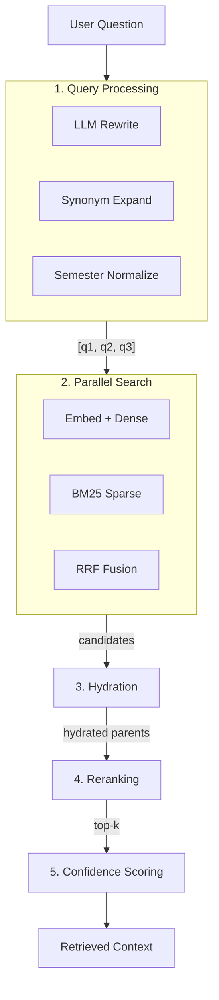
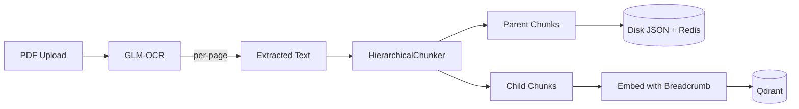

# Retrieval Pipeline

## Overview

The retrieval pipeline transforms a user question into relevant document context through multiple stages: query processing, vector search, result hydration, and ranking.

## Pipeline Stages



## 1. Query Processing

### Multi-Query Generation

For `query_document` intent, up to 3 query variants are generated:

| Variant | Source | Example |
|---------|--------|---------|
| Original | User input | "Kak, kalau aku telat bayar DPP, bisa ikut perwalian?" |
| Rewritten | LLM compression | "syarat perwalian pembayaran DPP" |
| Expanded | Synonym + normalization | "syarat perwalian pembayaran DPP" (with semester normalization) |

### Semester Numeral Normalization

Documents use Roman numerals ("Semester V") while users often type Arabic ("semester 5"). The query expander converts between formats:

- "semester 5" → "semester V" (for matching document headings)
- "semester V" → "semester 5" (for matching informal text)

### Synonym Expansion

Domain-specific Indonesian academic synonyms:
- "absen" → "ketidakhadiran"
- "tidak aktif" → "nonaktif"
- "cuti" → "cuti akademik"
- "drop out" → "dikeluarkan"

## 2. Ingestion Pipeline

### Document Processing Flow



### Hierarchical Chunking

Documents are parsed into a tree using heading pattern detection:

| Pattern | Type | Depth | Example |
|---------|------|-------|---------|
| `BAB [ROMAN]` | chapter | 1 | "BAB IV Alur Proses Studi" |
| `[ROMAN].[digit]` | section | 2 | "IV.1. Registrasi dan Perwalian" |
| `[ROMAN].[digit].[digit]` | subsection | 3 | "IV.1.1. Tahap Pendaftaran" |
| `Semester [ROMAN]` | subsection | 3 | "Semester V" |
| `Pilihan [digit]` | clause | 4 | "Pilihan 1" |
| `[digit]` | chapter | 1 | "7 Daftar sebaran mata kuliah" |
| `[digit].[digit]` | section | 2 | "6.1 Matrik Kurikulum" |

### Parent vs Child Chunks

| Aspect | Parent Chunk | Child Chunk |
|--------|-------------|-------------|
| Size limit | 8000 chars | 1200 chars |
| Storage | Disk (JSON) + Redis cache | Qdrant vector DB |
| Purpose | Full context for LLM | Retrieval target |
| Embedding | Not embedded | Embedded with breadcrumb prepend |

### Contextual Embedding

Before embedding, child chunk text is prepended with its breadcrumb:

```
# What gets embedded:
"III.4. Program Studi Teknik Informatika > Semester V\n<table>...IF2100501...</table>"

# What gets stored in payload (for display):
"<table>...IF2100501...</table>"
```

This ensures queries like "mata kuliah semester 5 teknik informatika" match chunks that only contain raw table HTML.

### Leaf Chapter Handling

Chapters without sub-sections (e.g., "7 Daftar sebaran mata kuliah tiap semester") are included as parent chunks alongside section-level nodes. Without this, their content would be lost from the index.

## 3. Search Strategies

### Pure Similarity (`RETRIEVAL_STRATEGY=similarity`)

- Dense cosine similarity only
- `score_threshold=0.2` minimum
- Candidate multiplier: 3x top_k

### RRF Hybrid (`RETRIEVAL_STRATEGY=rrf`)

- Dense + BM25 sparse vectors searched independently
- Fused with Reciprocal Rank Fusion (k=60)
- No absolute score threshold (relative filtering at 50% of top score)
- BM25 uses `Qdrant/bm25` model with stemmer enabled

### Reranker (`RETRIEVAL_STRATEGY=reranker`)

- First stage: same as RRF or similarity (wider candidate pool, 6x multiplier)
- Second stage: cross-encoder reranker scores each candidate
- Final threshold: score > 0.0

## 4. Configuration

| Parameter | Default | Description |
|-----------|---------|-------------|
| `RETRIEVAL_TOP_K` | 10 | Final number of parent chunks returned |
| `RETRIEVAL_STRATEGY` | reranker | Ranking strategy |
| `RERANKER_CANDIDATE_MULTIPLIER` | 6 | First-stage overfetch ratio |
| `parent_max_chars` | 8000 | Max parent chunk size before truncation |
| `child_max_chars` | 1200 | Max child chunk size |
| `child_overlap_chars` | 120 | Overlap between split child windows |
| `BM25_DISABLE_STEMMER` | False | Indonesian stemmer enabled |

## 5. Caching

Search results are cached in Redis with key based on:
- Query text
- Document type filter
- Top-k and score threshold
- Retrieval strategy and reranker config
- BM25 settings

Cache is automatically invalidated on document ingestion or deletion (`delete_prefix("search:")`).
